<div align="center">



<a href="https://www.linkedin.com/in/nourhan-emad-a550b2253/"></a>&nbsp;
<a href="mailto:nourhanemadenan11111@gmail.com"></a>

<br/>

<sub><code>NOURHAN EMAD / 知能</code> · training, evaluating, shipping</sub>

</div>

<br/>


| Project | What it does | Stack |
|---|---|---|
| **[Nasam](https://github.com/nourhanemadenan/nasam)** | Breath-sound disease detection from raw audio — Wav2Vec2 encoder with progressive unfreezing, F1-tuned decision threshold | PyTorch · Transformers · librosa |
| **[Digger](https://github.com/nourhanemadenan/digger)** | Multi-output forecasting of 10 global commodity prices, with inflation and armed-conflict features · **R² 0.99** | scikit-learn · XGBoost · pandas |
| **[Machine Failure Prediction](https://github.com/nourhanemadenan/machine-failure-prediction)** | Predictive maintenance on a 3.4%-positive class — SMOTE, 8 models, Keras Tuner NN · **0.68 recall on failures** | scikit-learn · XGBoost · TensorFlow |
| **[Breast Cancer Prediction](https://github.com/nourhanemadenan/breast-cancer-prediction)** | Six classifiers benchmarked on the Wisconsin diagnostic dataset · **98.2% accuracy** | scikit-learn · XGBoost |
| **[Liver Disease Prediction](https://github.com/nourhanemadenan/liver-disease-prediction)** | Hard, imbalanced clinical dataset — reported honestly, with the failure modes named | scikit-learn · pandas |

<br/>


<div align="center">


</div>

<br/>


```
01 /  Deep learning — transfer learning on pretrained audio and language encoders
02 /  Medical ML — diagnosis and screening models on small, imbalanced clinical data
03 /  Time-series regression — multi-target forecasting with exogenous features
04 /  Evaluation discipline — the confusion matrix, not the accuracy score
```

<br/>


<div align="center">

<a href="https://www.linkedin.com/in/nourhan-emad-a550b2253/"><b>LinkedIn</b></a> · <a href="mailto:nourhanemadenan11111@gmail.com"><b>nourhanemadenan11111@gmail.com</b></a>

<br/><br/>


</div>
